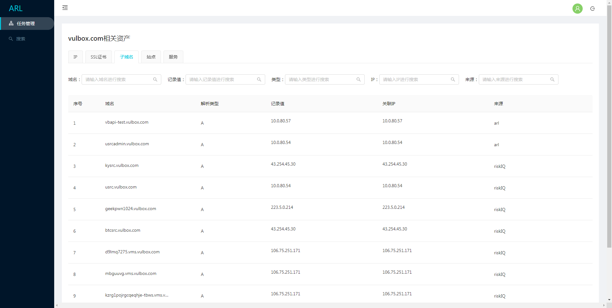
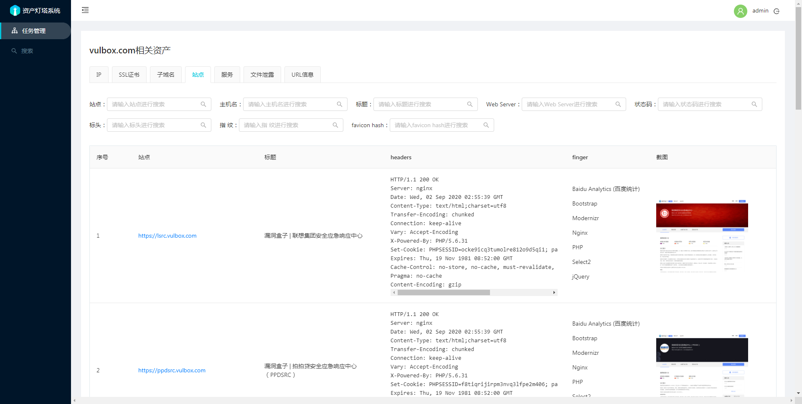

## ARL（Asset Reconnaissance Lighthouse）资产侦察灯塔系统

资产灯塔，不仅仅是域名收集


### 系统要求

目前暂不支持windows, mac和linux建议采用docker运行，系统配置最低2核4G
由于自动资产发现过程中会有大量的的发包，建议采用云服务器可以带来更好的体验。

### docker 启动
拉取镜像

```
docker pull tophant/arl
```

修改`docker/docker-compose.yml` 中services web image 和 services worker image 对应的镜像地址。


```
git clone https://github.com/TophantTechnology/ARL
cd ARL/docker/
docker-compose up -d 
```

### 截图
登录页面 默认用户名密码admin/arlpass


任务页面


子域名页面


站点页面



### 任务选项说明
| 编号 |      选项      |                       说明                       |
| --- | -------------- | ------------------------------------------------ |
| 1    | 任务名称        | 任务名称                                          |
| 2    | 任务目标        | 任务目标，支持IP,IP段，域名,可一次性下发多个目标      |
| 3    | 域名爆破类型    | 对域名爆破字典大小                                 |
| 4    | 端口扫描类型    | 端口扫描常用端口数量                               |
| 5    | 域名爆破        | 是否开启域名爆破                                   |
| 6    | DNS字典智能生成 | 根据已有的域名生成字典进行爆破                      |
| 7    | Riskiq 调用    | 利用[RiskIQ](https://community.riskiq.com/)  API进行查询域名                        |
| 8    | ARL 历史查询    | 对arl历史任务结果进行查询用于本次任务                |
| 9    | 端口扫描        | 是否开启端口扫描，不开启站点会默认探测80,443         |
| 10   | 服务识别        | 是否进行服务识别，有可能会被防火墙拦截导致结果为空     |
| 11   | 操作系统识别    | 是否进行操作系统识别，有可能会被防火墙拦截导致结果为空 |
| 12   | Fofa IP查询    | 利用[Fofa](https://fofa.so/)  API进行查询域名                          |
| 13   | SSL 证书获取    | 对端口进行SSL 证书获取                             |
| 14   | 站点识别        | 对站点进行指纹识别                                 |
| 15   | 搜索引擎调用    | 利用搜索引擎结果爬取对应的URL                       |
| 16   | 站点爬虫        | 利用静态爬虫对站点进行爬取对应的URL                  |
| 17   | 站点截图        | 对站点首页进行截图                                 |
| 18   | 文件泄露        | 对站点进行文件泄露检测，会被WAF拦截                  |

### 配置参数说明

|       配置        |                 说明                 |
| ----------------- | ------------------------------------ |
| CELERY.BROKER_URL | rabbitmq连接信息                      |
| MONGO             | mongo 连接信息                        |
| RISKIQ            | riskiq API 配置信息                   |
| GEOIP             | GEOIP 数据库路径信息                  |
| FOFA              | FOFA API 配置信息                     |
| ARL.AUTH          | 是否开启认证，不开启有安全风险          |
| ARL.API_KEY       | arl后端API调用key，如果设置了请注意保密 |
| ARL.BLACK_IPS     | 为了防止SSRF，屏蔽的IP地址或者IP段      |


### 密码修改

```
docker exec -ti arl_mongodb mongo -u admin -p admin
```
使用`use arl`切换数据库，复制docker目录下的mongo-init.js文件的内容执行进行修改密码。


### 本地安装

下载安装phantomjs,要添加到环境变量

http://phantomjs.org/download.html

```
yum install epel-release
yum install mongodb-server mongodb rabbitmq-server supervisor
yum install wqy-microhei-fonts fontconfig
```

或者
```
sudo apt-get install mongodb-server rabbitmq-server supervisor
sudo apt-get install xfonts-wqy libfontconfig
```


### 安装最新版nmap

#### ubuntu
```
apt remove nmap
apt remove ndiff
apt install alien
wget https://nmap.org/dist/nmap-7.80-1.x86_64.rpm
alien -i nmap-7.80-1.x86_64.rpm
```

#### centos
```
rpm -vhU https://nmap.org/dist/nmap-7.80-1.x86_64.rpm
```


### 本地编译Docker镜像 并启动

```
docker build  -t arl_worker:v2 -f docker/worker/Dockerfile .
cd docker
pip install docker-compose
docker-compose up -d
```

### 配置Geoip 数据库

由于官方政策更新请前往[maxmind](https://dev.maxmind.com/geoip/geoip2/geolite2/) 注册下载GeoLite2-City.tar.gz，GeoLite2-ASN.tar.gz 解压。  
在config.yaml中配置好相关路径


### 写在最后

目前ARL仅仅只是完成了对资产的部分维度的发现和收集，自动发现过程中难免出现覆盖度不全、不精准、不合理等缺陷的地方还请谅解。 
后面还有更多有意思的东西以及资产管理和监控部分敬请期待。
